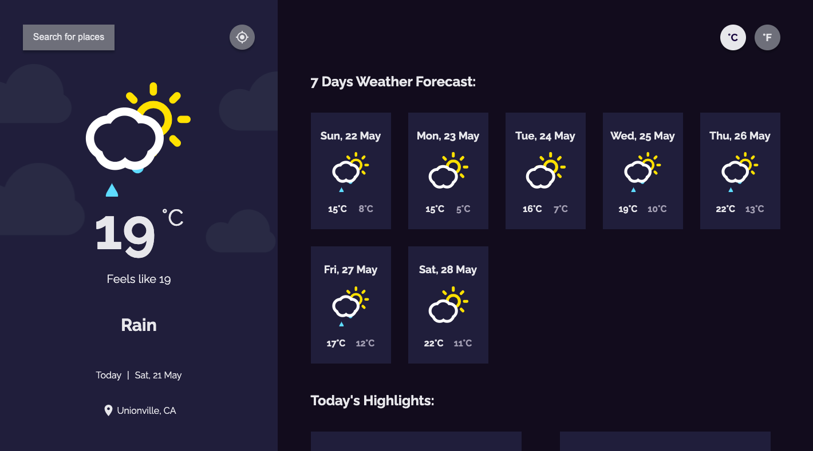

# Weather App :partly_sunny:

Design heavily inspired by <a href="https://devchallenges.io/challenges/mM1UIenRhK808W8qmLWv">DevChallenges<a>

A weather app that can display the local weather information from the user's current location and timezone, and also the ability to search for any cities' current detailed weather information with timezone offset taken into account.

## Features:

- User is able to see his/her current location weather by default
- User is able to search for any city's current weather information
- User is able to see weather of today and the next 7 days
- User is able to see the date and location of the weather
- User is able to see according to image for each type of weather
- User is able to see the min and max degree each day
- User is able to see highlights of today's weather including wind status, humidity, visibility, air pressure
- User is able to request his/her current location weather
- User is able to convert temperature in Celsius to Fahrenheit and vice versa

## Language and Tools:

  
